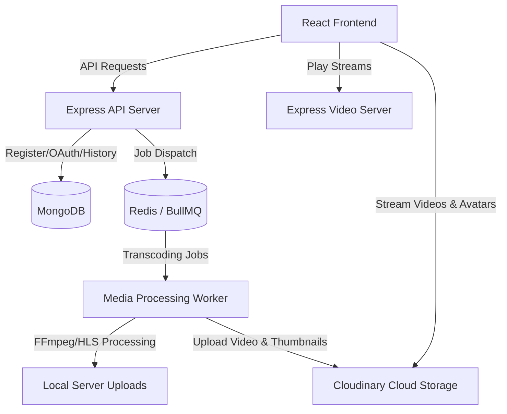

# StreamSphere OTT Streaming Platform

StreamSphere is a modern, high-performance, containerized Over-The-Top (OTT) video streaming platform. It features adaptive HLS video streaming, automated transcoding pipelines, cloud asset management via Cloudinary, secure role-based authentication, real-time job processing, and an interactive admin dashboard.

---

## Architecture Overview



---

## Core Features

- **Adaptive Bitrate Streaming**: Uses FFmpeg to convert uploaded MP4 source files into standard HLS (`.m3u8`) multi-resolution streams (360p, 720p, 1080p, etc.).
- **Cloud Media Pipeline**: Built-in support for Cloudinary to manage videos, generated thumbnails, and profile avatars securely, minimizing local storage overhead.
- **Robust Queue Management**: Leverages Redis and BullMQ to handle background transcoding and file migrations asynchronously, ensuring non-blocking user operations.
- **Admin Dashboard & Analytics**:
  - Timezone-aware date aggregations (`Asia/Kolkata`) displaying accurate registration and active user data.
  - Interactive ApexCharts showing Daily Active Users (DAU), New Signups, category distributions, and BullMQ queue statuses.
- **Watch Progress & Resume**: Automatic tracking of viewer progress in MongoDB; users can resume videos from where they left off (watched $\ge$ 95% is marked complete).
- **Authentication**: Secure JWT credentials validation and integrated Google OAuth flow.

---

## Project Structure

```text
StreamSphere/
├── client/                 # React SPA frontend
│   ├── public/             # Static public assets
│   └── src/                # React source code (components, pages, themes)
├── server/                 # Express backend and workers
│   ├── scripts/            # Database migrations and preset seeders
│   ├── src/                # Express API router, MongoDB models, BullMQ queues
│   └── uploads/            # Temporary directories for local media uploads
├── docker-compose.yml      # Orchestrates all local system services
└── README.md               # Project documentation
```

---

## Frontend Setup (`client`)

The frontend is a single-page application built on **React** with a custom Material-UI (MUI) design system and interactive charts.

### Tech Stack
- **Framework**: React 18
- **UI & Layout**: Material-UI (MUI) v5
- **Charts**: ApexCharts & React-Apexcharts
- **Forms & Validation**: Formik & Yup
- **Router**: React Router DOM v6
- **Http Client**: Axios

### Configuration
Create a `.env` file inside the `client/` folder:
```env
REACT_APP_API_SERVER=http://localhost:4000
REACT_APP_VIDEO_SERVER=http://localhost:4001
```

### Installation & Run
1. Navigate to the client folder:
   ```bash
   cd client
   ```
2. Install dependencies:
   ```bash
   npm install
   ```
3. Run the development server:
   ```bash
   npm start
   ```
4. Build for production:
   ```bash
   npm run build
   ```

---

## Backend Setup (`server`)

The backend consists of an Express API server, a dedicated BullMQ worker for media transcoding, and a static express video file server.

### Tech Stack
- **Runtime**: Node.js v22 (Alpine Docker base)
- **API Framework**: Express
- **Database**: MongoDB (via official native driver)
- **Caching & Queue**: Redis & BullMQ
- **Media Engine**: FFmpeg (via fluent-ffmpeg)
- **Cloud Storage**: Cloudinary SDK

### Configuration
Create a `.env` file inside the `server/` folder:
```env
PORT=4000
VIDEO_PORT=4001
MONGODB_URL=mongodb://localhost:27017
MONGODB_DB_NAME=streamsphere
REDIS_SERVER=localhost
REDIS_PORT=6379

# Storage Provider Config (local / cloudinary)
UPLOAD_STORAGE=cloudinary

# Cloudinary Integration Keys
CLOUDINARY_CLOUD_NAME=your_cloud_name
CLOUDINARY_API_KEY=your_api_key
CLOUDINARY_API_SECRET=your_api_secret

# Google OAuth Config
GOOGLE_CLIENT_ID=your_google_client_id
GOOGLE_CLIENT_SECRET=your_google_client_secret

# Token Keys
JWT_SECRET=your_jwt_signing_secret
```

### Installation & Run
1. Navigate to the server folder:
   ```bash
   cd server
   ```
2. Install dependencies (requires locally installed FFmpeg):
   ```bash
   npm install
   ```
3. Run server services:
   - Run API Web Server: `npm run web-server`
   - Run Queue Processor Worker: `npm run video-processor`
   - Run Video File Server: `npm run video-server`
   - Run all concurrently: `npm run server`

### Seeding & Helper Scripts
- **Seed initial user roles**: `node scripts/seed-data/role.js`
- **Upload default preset avatars to Cloudinary**: `node scripts/upload-avatars-to-cloudinary.js`
- **Migrate existing local uploads to Cloudinary**: `node scripts/migrate-to-cloudinary.js`

---

## Run with Docker Compose

To build and spin up the entire application stack (API server, BullMQ worker, React frontend, MongoDB database, and Redis cache) with a single command:

1. Make sure Docker and Docker Compose are installed.
2. Run at the root of the project:
   ```bash
   docker compose up --build
   ```
3. Access the application:
   - Frontend: [http://localhost:3000](http://localhost:3000)
   - Backend API: [http://localhost:4000](http://localhost:4000)
   - Video server: [http://localhost:4001](http://localhost:4001)
